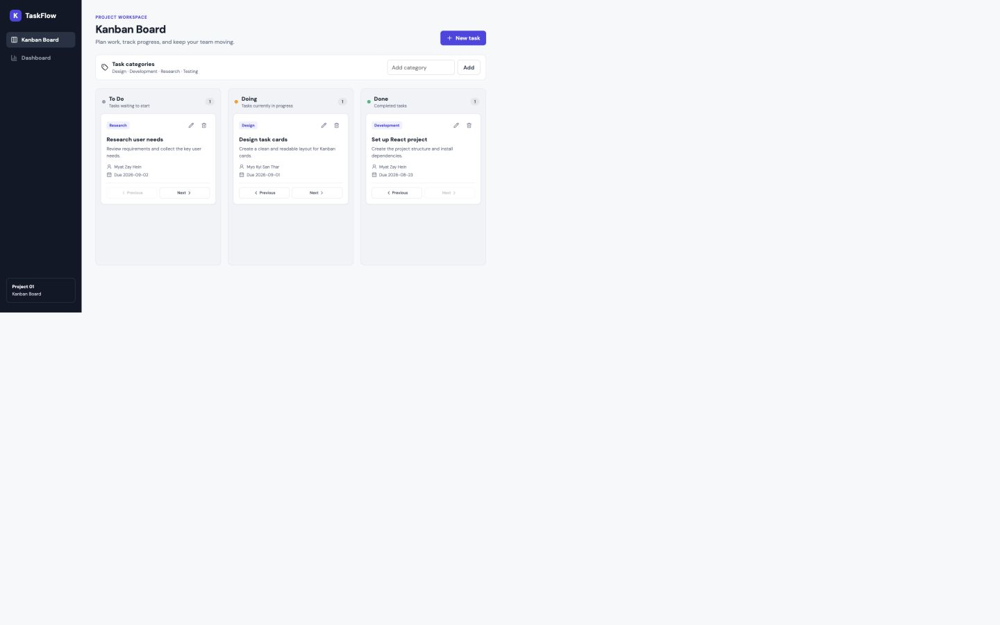
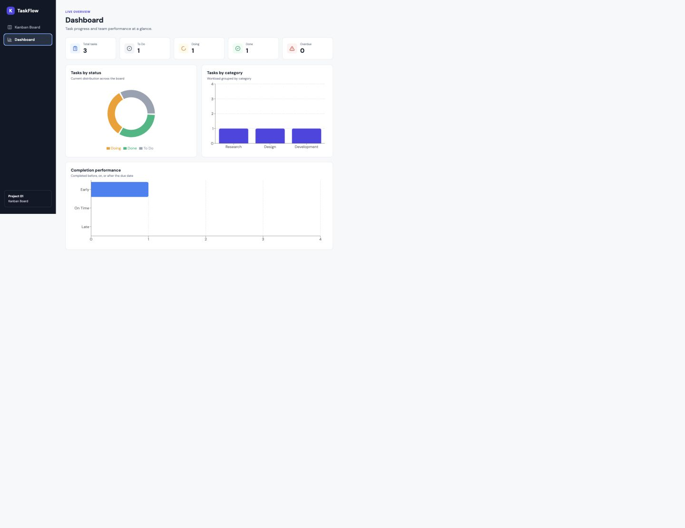

# TaskFlow — Kanban Board with Dashboard

TaskFlow is a client-side task management application built with React. It gives a team a three-column Kanban Board for managing work and a Dashboard that summarizes task status, category distribution, overdue work, and completion performance.

## Live application

[https://myatzay.github.io/kanban-dashboard/](https://myatzay.github.io/kanban-dashboard/)

## Features

- Create, edit, and delete tasks.
- Move tasks between To Do, Doing, and Done.
- Automatically record a completion date when a task moves to Done.
- Assign a category, responsible person, start date, and due date to each task.
- Add reusable task categories and prevent duplicates.
- Save tasks and categories in Local Storage.
- Restore saved data after refreshing or reopening the application.
- View totals for all tasks, To Do, Doing, Done, and overdue tasks.
- View task status as a doughnut chart.
- View task counts per category as a bar chart.
- Compare Early, On Time, and Late task completion.
- Use the application on desktop, tablet, and mobile screens.

## Screenshots

### Kanban Board



### Dashboard



## Technologies

- React
- Vite
- React Router
- Recharts
- Lucide React
- CSS
- Browser Local Storage

## Getting started

### Requirements

- Node.js 20 or later
- npm

### Installation

```bash
git clone https://github.com/MyatZay/kanban-dashboard.git
cd kanban-dashboard
npm install
npm run dev
```

Open the local URL printed in the terminal.

## Basic usage

1. Select **New task** on the Kanban Board.
2. Enter the task information and select **Create task**.
3. Use **Previous** and **Next** on a task card to change its status.
4. Use the pencil button to edit a task or the bin button to delete it.
5. Enter a name in **Add category** to create another task category.
6. Open **Dashboard** to view live totals and charts.

## Data and calculations

Tasks and categories are serialized as JSON and stored under separate Local Storage keys. React loads this saved data when the application starts and writes updated data whenever tasks or categories change.

A task is overdue when its due date has passed and its status is not Done. Completion performance includes completed tasks with a due date and completion date:

- **Early:** completion date is before the due date.
- **On Time:** completion date is the same as the due date.
- **Late:** completion date is after the due date.

## Quality checks

```bash
npm run lint
npm run build
```

## Group members

- Myat Zay Hein
- Myo Kyi San Thar

Member names only are listed as required; student IDs are intentionally excluded.
